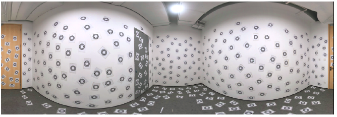

# Single-Shot is Enough: Panoramic Infrastructure Based Calibration of Multiple Cameras and 3D LiDARs


## Updates

* [2021/09/01] first commit, source code of localization and calibration stage; Given sparse map of panoramic infrastructure, we can easily calibrate the extrinsics among multi-camera and multi-LiDAR. In order to facilitate camera intrinsic calibration and imu calibration, [Kalibr toolbox](https://github.com/ethz-asl/kalibr) is used in our scripts, and [imu_utils](https://github.com/gaowenliang/imu_utils) code is  simplified in our source code. 
* [2021/10/01] source code of panoramic infrastructure reconstruction; coming soon...


## Introduction

 This paper is accpeted in 2021 IROS, the preprint version is accessible in [arXiv](https://arxiv.org/abs/2103.12941).  In this paper, we propose a single-shot solution for calibrating extrinsic transformations among multiple cameras and 3D LiDARs. We establish a panoramic infrastructure, in which a camera or LiDAR can be robustly localized using data from single frame. Experiments are conducted on three devices with different camera-LiDAR configurations, showing that our approach achieved comparable calibration accuracy with the state-of-the-art approaches but with much greater efficiency.




## Prerequisities
1. **Kalibr**

   Follow  [Kalibr installation](https://github.com/ethz-asl/kalibr/wiki/installation).

2. **Ceres**

   follow [ceres installation](http://ceres-solver.org/installation.html).

3. **CCTag**

   Follow [cctag installation](https://github.com/fangchuan/CCTag/blob/develop/INSTALL.md).

4. **Yaml-cpp**(>=0.6.0)

   Follow [yaml-cpp installation](https://github.com/jbeder/yaml-cpp#how-to-build).

5. **Boost**(>=1.69)

   Follow [boost installation](https://www.boost.org/doc/libs/1_76_0/more/getting_started/unix-variants.html#id26).

6. **Open3D**(>=0.10)

   follow [open3d installation](http://www.open3d.org/docs/release/compilation.html#ubuntu-macos).


## Docker Support

To further facilitate the building process, we add docker in our code. Docker environment is like a sandbox, thus makes our code environment-independent.

Docker build:

```bash
docker/build
```

Run docker with outr test data, please refer to [docker_usage_en.md](./docker_usage_en.md).


## Quick Start

1. Build the source code:
  
   ```bash
   git clone xxx
   cd xxx
   mkdir build && cd build
   cmake ..
   make -j8
   ```
   
2. Download the [test data](https://drive.google.com/file/d/1aaWk44UUGWs6tE-ATOtT1qy7E_eiUQUu/view?usp=sharing).

3. Refer to [docker_useage_en.md](./docker_usage_en.md) for further particular calibration task.


## Citation

If you find this code is useful in your research, please cite:

```
@article{fang2021single,
  title={Single-Shot is Enough: Panoramic Infrastructure Based Calibration of Multiple Cameras and 3D LiDARs},
  author={Fang, Chuan and Ding, Shuai and Dong, Zilong and Li, Honghua and Zhu, Siyu and Tan, Ping},
  journal={arXiv preprint arXiv:2103.12941},
  year={2021}
}
```


## Acknowledgements

Thanks to gaowenliang for opening source of his excellent works  [imu_utils](https://github.com/gaowenliang/imu_utils). Thanks to the maintenance team of Kalibr for the well-known open-source project [Kalibr](https://github.com/ethz-asl/kalibr).

## License
The source code is released under MIT license.

We are still working on improving the performance and reliability of our codes. For any technical issues, please contact me via email <fang1457737815@gmail.com>.